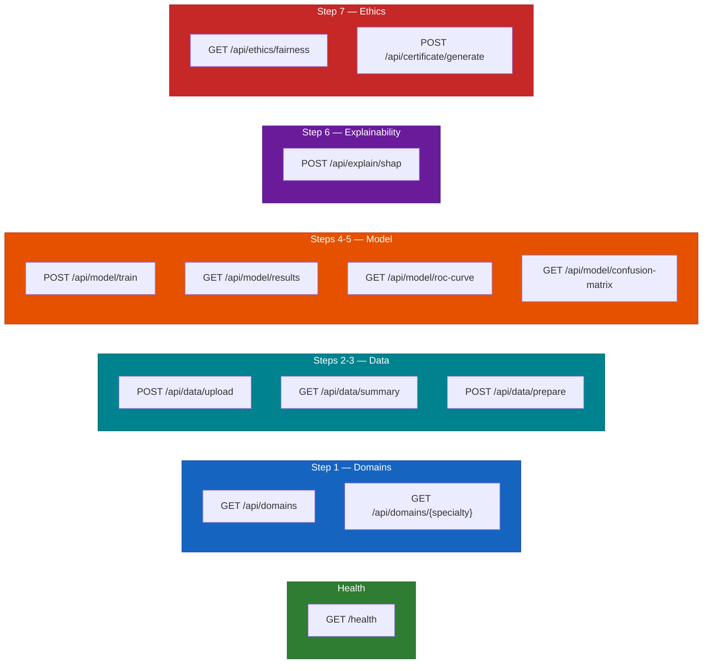

# API Endpoints

Planned REST API route map for MedVix backend.

## Endpoint Details

### Health
| Method | Path | Description |
|--------|------|-------------|
| GET | `/health` | Server health check |

### Step 1 — Clinical Context
| Method | Path | Description |
|--------|------|-------------|
| GET | `/api/domains` | List all 20 medical domains |
| GET | `/api/domains/{specialty}` | Get domain details (description, target variable, dataset info) |

### Steps 2-3 — Data
| Method | Path | Description |
|--------|------|-------------|
| POST | `/api/data/upload` | Upload CSV file or select built-in dataset |
| GET | `/api/data/summary` | Column statistics, types, missing values |
| POST | `/api/data/prepare` | Apply preprocessing (split, impute, normalise, SMOTE) |

### Steps 4-5 — Model & Results
| Method | Path | Description |
|--------|------|-------------|
| POST | `/api/model/train` | Train selected model with hyperparameters |
| GET | `/api/model/results` | Get all 6 evaluation metrics |
| GET | `/api/model/roc-curve` | ROC curve data points |
| GET | `/api/model/confusion-matrix` | Confusion matrix values |

### Step 6 — Explainability
| Method | Path | Description |
|--------|------|-------------|
| POST | `/api/explain/shap` | Compute SHAP values (global + single patient) |

### Step 7 — Ethics & Bias
| Method | Path | Description |
|--------|------|-------------|
| GET | `/api/ethics/fairness` | Subgroup fairness metrics table |
| POST | `/api/certificate/generate` | Generate PDF summary certificate |
