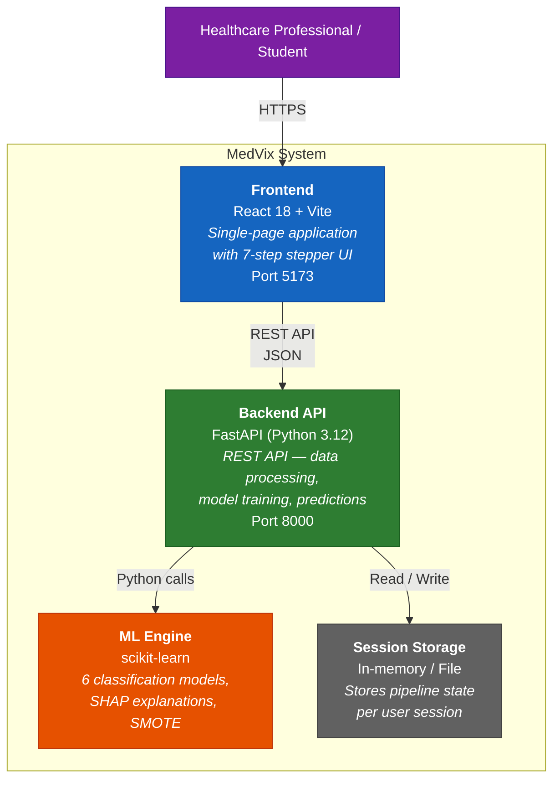

# C4 — Container Diagram

Shows the major containers (deployable units) inside MedVix and how they communicate.

## Container Details

| Container | Technology | Responsibility |
|-----------|-----------|---------------|
| Frontend | React 18 + Vite | Browser UI — stepper, domain pills, sliders, charts, PDF export |
| Backend API | FastAPI + Uvicorn | REST endpoints — data upload, preprocessing, training, metrics |
| ML Engine | scikit-learn, SHAP, imbalanced-learn | Model training, evaluation, SHAP explanations, SMOTE balancing |
| Session Storage | In-memory (dev) | Persists user pipeline state between steps |
