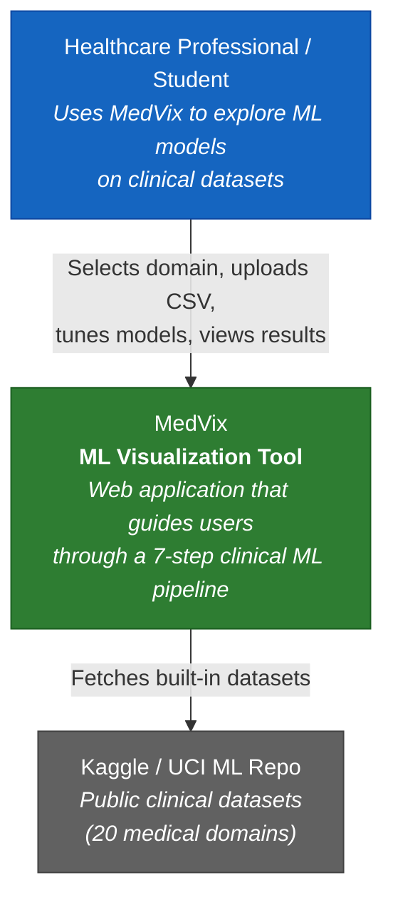

# C4 — System Context Diagram

Shows how MedVix fits into the broader environment and who interacts with it.

## Actors

| Actor | Description |
|-------|-------------|
| Healthcare Professional | Doctor, nurse, or clinical researcher using MedVix for ML-guided analysis |
| Student | University student learning ML concepts through the interactive pipeline |

## External Systems

| System | Description |
|--------|-------------|
| Kaggle / UCI ML Repository | Source for the 20 built-in clinical datasets |
