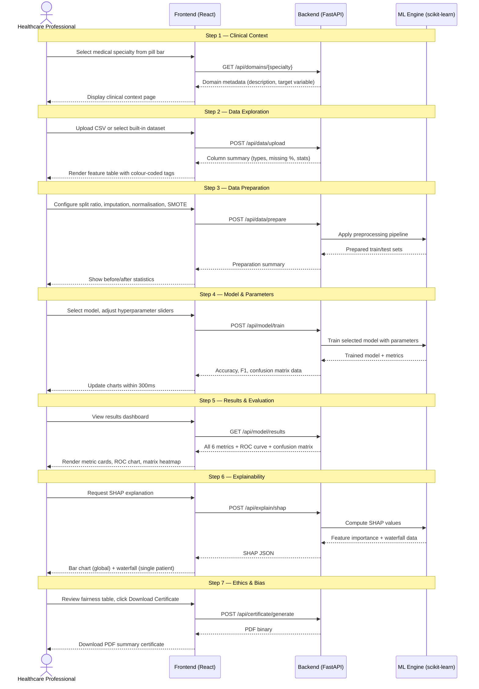

# Data Flow — 7-Step Pipeline

Sequence diagram showing data flow through all 7 pipeline steps.

## Pipeline Summary

| Step | API Endpoint | Input | Output |
|------|-------------|-------|--------|
| 1. Clinical Context | `GET /api/domains/{specialty}` | Specialty name | Domain metadata |
| 2. Data Exploration | `POST /api/data/upload` | CSV file or dataset ID | Column summary |
| 3. Data Preparation | `POST /api/data/prepare` | Preprocessing config | Prepared datasets |
| 4. Model & Parameters | `POST /api/model/train` | Model type + hyperparams | Trained model + metrics |
| 5. Results | `GET /api/model/results` | — | 6 metrics + charts |
| 6. Explainability | `POST /api/explain/shap` | — | SHAP values |
| 7. Ethics & Bias | `POST /api/certificate/generate` | — | PDF certificate |
